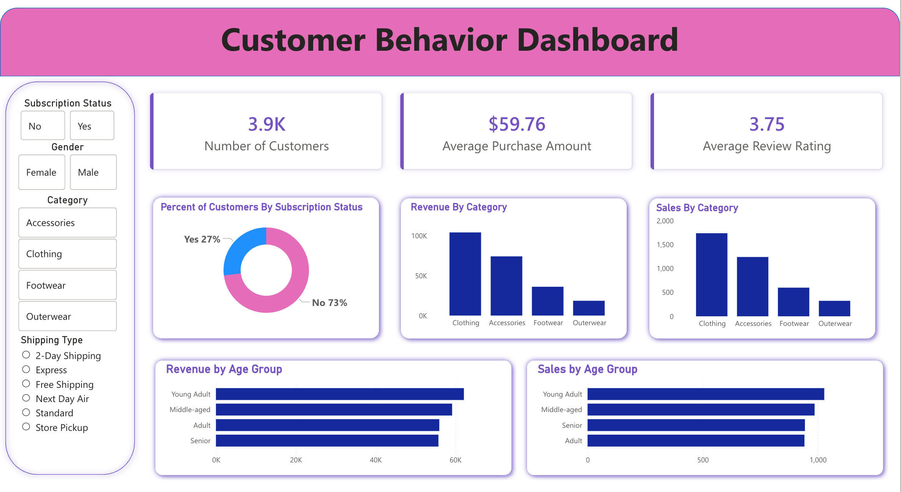

# Customer Shopping Behavior Analysis

## Overview

This project analyzes customer shopping behavior using a retail transaction dataset. The goal was to clean the raw data, prepare it for analysis, answer business questions with SQL, and build a Power BI dashboard to present the main findings visually.

The project focuses on customer spending patterns, product performance, subscription behavior, discount usage, shipping type, and age-based revenue trends.

## Dataset

The dataset contains 3,900 customer purchase records and 18 original columns.

Key columns include:

- Customer ID
- Age
- Gender
- Item Purchased
- Category
- Purchase Amount
- Location
- Size
- Color
- Season
- Review Rating
- Subscription Status
- Shipping Type
- Discount Applied
- Promo Code Used
- Previous Purchases
- Payment Method
- Frequency of Purchases

## Tools Used

- Python
- pandas
- PostgreSQL
- SQL
- Power BI
- Jupyter Notebook
- GitHub

## Project Steps

### 1. Loaded the Data

The dataset was loaded into Python using pandas. I reviewed the first few rows, checked the dataset shape, inspected data types, and looked for missing values.

### 2. Cleaned the Data in Python

Python was used to prepare the dataset before loading it into PostgreSQL.

The cleaning process included:

- Checked the dataset shape and column data types
- Identified missing values in the `review_rating` column
- Filled missing review ratings using the median review rating within each product category
- Renamed columns into snake case for easier SQL use
- Renamed `purchase_amount_(usd)` to `purchase_amount`
- Removed the `promo_code_used` column because it had the same values as `discount_applied`
- Exported the cleaned dataset as `clean_customer_data.csv`

### 3. Created New Features in Python

Python was also used for feature engineering.

New columns included:

- `age_group`: grouped customers into age categories
- `purchase_frequency_days`: converted purchase frequency labels into estimated day values

These columns made the dataset easier to analyze in SQL and visualize in Power BI.

### 4. Loaded the Data into PostgreSQL

After cleaning the dataset, I connected Python to PostgreSQL using SQLAlchemy and loaded the cleaned DataFrame into a PostgreSQL table named `customer`.

This allowed the cleaned data to be queried using SQL.

### 5. Answered Business Questions with SQL

SQL was used to answer several business-style questions, including:

- Total revenue generated by male vs. female customers
- Customers who used a discount but still spent more than the average purchase amount
- Top 5 products with the highest average review rating
- Average purchase amount for Standard vs. Express shipping
- Average and total revenue for subscribers vs. non-subscribers
- Products with the highest discount usage rate
- Customer segmentation based on previous purchases
- Top 3 most purchased products within each category
- Whether repeat buyers were likely to subscribe
- Revenue contribution by age group


## Dashboard

A Power BI dashboard was created to summarize the main findings visually.

The dashboard includes:

- Number of customers
- Average purchase amount
- Average review rating
- Percent of customers by subscription status
- Revenue by category
- Sales by category
- Revenue by age group
- Sales by age group
- Filters for subscription status, gender, category, and shipping type



### 7. Created a Findings and Recommendations Report

A final PDF report was created to summarize the main SQL findings and business recommendations. The report explains the most important patterns found in the analysis, including revenue by gender, discount behavior, product ratings, subscription patterns, customer loyalty, and age group revenue.


## Files in This Repository

```text
CustomerShoppingBehaviorAnalysis.ipynb
customer_shopping_behavior.csv
clean_customer_data.csv
customer_behavior_queries.sql
customer_behavior_dashboard.pbix
customer_behavior_dash_image.png
Customer Behavior Findings and Recommendations.pdf
README.md
.gitignore
